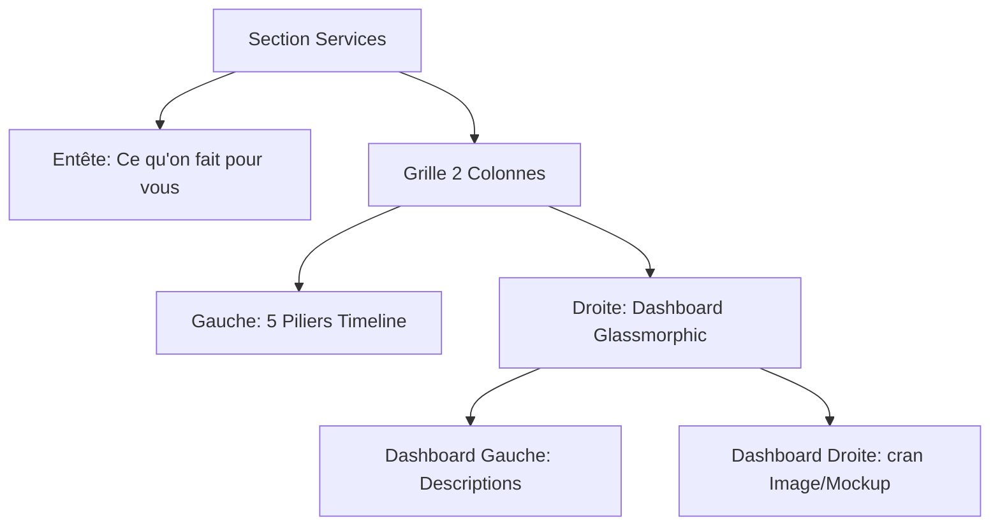

# Spécification Technique — Showcase de Services avec Dashboard Glassmorphic Unifié

Ce document présente l'architecture mise à jour selon le croquis de l'utilisateur.

## Structure de la Grille (Desktop)

Le layout général est divisé en deux grandes zones :
1. **Colonne gauche (3.5fr)** : Le menu de navigation vertical composé des 5 piliers sous forme de cartes d'onglets épurées.
2. **Colonne droite (8.5fr)** : Le dashboard unifié `.svc-showcase` qui regroupe la description active et l'illustration visuelle.



## Choix de Design & Graphisme (2026-2027 Agentic Era)

- **Le Dashboard (`.svc-showcase`)** : Un grand conteneur arrondi (`border-radius: 24px`) avec un arrière-plan en verre liquide sombre, une bordure fine blanche (`border: 1px solid rgba(255,255,255,0.06)`), et un flou d'arrière-plan prononcé (`backdrop-filter: blur(20px)`).
- **Le split interne** :
  - **À gauche** : Le bloc description `.svc-desc-panel` avec son titre contrasté, son texte descriptif, ses tags colorés en violet fluide et ses boutons d'action.
  - **À droite** : L'écran TV cinématographique `.svc-showcase__screen` affichant les images et illustrations.
- **Micro-interactions** :
  - La progression verticale se fait sur le côté gauche de chaque pilier.
  - Les changements de scène déclenchent des animations GSAP de transition et de zoom sur l'illustration à droite et de glissement vertical pour les textes à gauche.

## Structure HTML Attendue

```html
<div class="svc-layout">
  <!-- Colonne GAUCHE : Chronologie des Piliers -->
  <div class="svc-pillars-col">
    <div class="svc-pillars-sidebar">
      <div class="svc-nav-list">
        <!-- 5 svc-card -->
      </div>
    </div>
  </div>

  <!-- Colonne DROITE : Dashboard unifié -->
  <div class="svc-showcase-col">
    <div class="svc-showcase">
      <!-- Partie gauche du dashboard : Textes -->
      <div class="svc-desc-panel">
        <!-- svc-desc-pane -->
      </div>

      <!-- Partie droite du dashboard : Média/Écran -->
      <div class="svc-showcase__screen">
        <!-- svc-scene -->
      </div>
    </div>
  </div>
</div>
```
